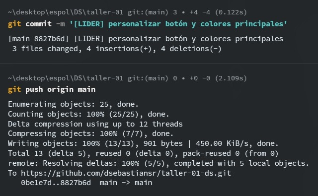
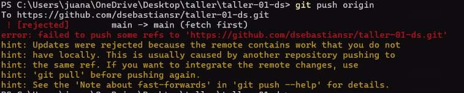
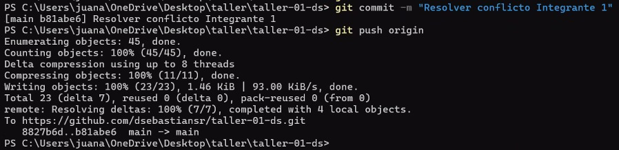
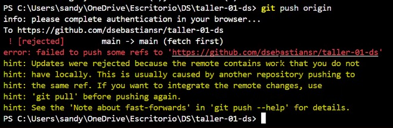
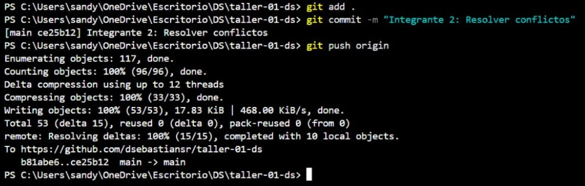

## Integrantes y roles

Complete esta tabla al final del taller.

| Rol | Nombre | Usuario de GitHub | Commit principal |
| --- | --- | --- | --- |
| Líder | David Sanchez  | dsebastiansr | [LIDER] personalizar botón y colores principales  |
| Integrante 1 | Juan Navia  | DevKai92  |  Integrante 1: cambiar botón y cabeza de snake  |
| Integrante 2 | Anthony Yepez | JNaviasf| Integrante 2: Cambiar boton y colector del gold  |

## Evidencias

Coloque las capturas dentro de una carpeta llamada `capturas/` y enláselas en esta sección.

### Líder

Push exitoso:

### Integrante 1

Error antes de resolver conflicto:

Push exitoso después de resolver conflicto:

### Integrante 2

Error antes de resolver conflicto:

Push exitoso después de resolver conflicto:

